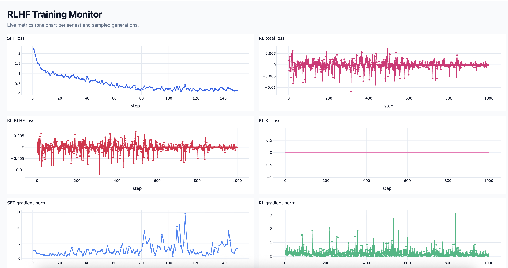

# RLHF Foundations: Try RLHF on your Local Macbook

This is a small compact codebase for learning RLHF concepts that you can run on your Mac or Linux machine. Main purpose here is for people new to post-training and RLHF, to use this to learn basic concepts on their computer without needing GPUs. The code contains recent policy-optimization methods, a simple MoE-based transformer, and simple tasks environments that you can train on in 10-20min. 

**Simulate Real-World Challenges:** Since the purpose of this repository is learning without access to a GPU cluster, one important feature this codease provides is to simulate certain bad behaviors that occur in practice. Presently, we simulate the issue that arise due to mismatch between log-probs in inference and training in LLMs which is specially bad for MoEs.

**Accompanying Book:** An accompanying PDF on RLHF foundations is planned for a later release this summer. If you have any specific request, then create an issue or email me.

**This is a beta release (June-4-2026)**: Some features maybe broken. A stable release will come in under a week.

## Quick start

This project uses [uv](https://docs.astral.sh/uv/) for environment and dependency management. Ensure uv is installed by following the [official installation guide](https://docs.astral.sh/uv/getting-started/installation/), then run the code on a sample YAML file as shown:

```bash
uv run scripts/run_rl.py --config configs/dyck_grpo.yaml
```

`uv run` automatically creates a virtual environment and installs the dependencies (declared in `pyproject.toml`) on first use, so there is no separate install step.

The training script loads YAML config, applies optional CLI overrides (OmegaConf dot paths), then runs the configured training `stages` in order (typically an SFT stage followed by an RL stage). With visualization enabled, a live dashboard opens in your browser at `http://127.0.0.1:8050`. It will open a window and results will start filling in as shown:



Override any field from the command line (stages are indexed, so the RL stage in the sample configs is `stages.1`):

```bash
uv run scripts/run_rl.py --config configs/dyck_grpo.yaml \
  stages.1.trainer=gspo \
  stages.1.max_epochs=5 \
  data_config.train_size=32 \
  visualize.enabled=false
```

## Repository layout

```
rlhf2/
  rlhf/          # RL trainers (GRPO, GSPO, CISPO, TIS, IcePop), SFT, evaluation
  llm/           # Transformer, RoPE, MoE building blocks
  tasks/         # Task environments and tokenizers (Dyck language, Block mirroring)
  utils/         # Pydantic configs and live Dash visualizer
configs/         # Experiment YAML files
scripts/         # Entry points (run_rl.py)
pyproject.toml   # Project metadata and dependencies (managed with uv)
```

1. **Data** — Sample unique prompts from the task, split into train/val (`scripts/run_rl.py`).
2. **Stages** — Run the configured `stages` in order on a shared model. The sample configs use an SFT stage then a GRPO stage, but you can list any number of stages and pick the trainer per stage.
3. **RL** — Batched rollout, reward, and policy update (GRPO-family objectives).
4. **Monitoring** — Losses, gradient norms, rewards, and sample generations in the Dash UI (one section per stage).

Two sample tasks are provided. These tasks are chosen to be only slightly hard so they can be trained in 10-20min on a Macbook.

- **Dyck language** (`tasks/dyck.py`) — Complete a partial bracket string `([{` with valid closings from `( )`, `[ ]`, `{ }`. Reward is 1 when the full string is balanced, 0 otherwise.

- **Block arrangement** — Mirror image a sequence of blocks (e.g., red red blue green -> green blue red red) (`tasks/block.py`).

More tasks maybe added in the future.

## RL algorithms

| Algorithm | Trainer class | Module | Reference |
|-----------|---------------|--------|-----------|
| GRPO | `GRPOTrainer` | `rlhf/grpo_trainer.py` | [Paper](https://arxiv.org/pdf/2402.03300) |
| GSPO | `GSPOTrainer` | `rlhf/gspo_trainer.py` | [Paper](https://arxiv.org/pdf/2507.18071) |
| CISPO | `CISPOTrainer` | `rlhf/cispo_trainer.py` | [Paper](https://arxiv.org/pdf/2506.13585) |
| TIS | `TISTrainer` | `rlhf/tis_trainer.py` | [Blog](https://fengyao.notion.site/off-policy-rl) |
| IcePop | `IcePopTrainer` | `rlhf/icepop_trainer.py` | [Blog](https://ringtech.notion.site/icepop) |

Shared rollout/generation utilities live in `rlhf/inference.py` (`batch_generate`, `batch_generate_with_rewards`) so any stage can sample completions. The RL training loop and GRPO objective live in `GRPOTrainer` (`rlhf/grpo_trainer.py`); the other algorithms above subclass it and override `calc_loss`. SFT is handled by `SFTTrainer` (`rlhf/sft_trainer.py`). DPO and reward modeling are in `DPOTrainer` (`rlhf/dpo_trainer.py`) and `rlhf/reward_modeling.py` for preference-style experiments.

Training is configured as an ordered list of `stages`, each selecting a `trainer`. For example, an `sft` stage followed by a `grpo` stage (also `gspo`, `cispo`, `tis`, `icepop`):

```yaml
stages:
  - trainer: sft
    max_epochs: 3
  - trainer: grpo
    max_epochs: 20
    K: 4
```

## LLM Implementation

`llm/transformer.py` contains a compact causal transformer with multi-head attention and RoPE (or absolute positions). The file `llm/moe.py` provides mixture-of-experts layers and `llm/experts.py` provides list of expert models -- currently, MLP and SwishGLU.

## Configuration

Top-level config sections (see `utils/data_types.py`):

| Section | Purpose |
|---------|---------|
| `data_config` | Dataset sizes, batching, and domain specific hyperparameters |
| `llm_config` | Transformer shape (layers, dim, heads, `max_seq`) |
| `stages` | Ordered training stages; each picks a `trainer` (`sft`, `grpo`, `gspo`, `cispo`, `tis`, `icepop`) with its own hyperparameters and `inference` settings |
| `visualize` | Live dashboard (port, logging frequency, generations table) |
| `device` | e.g. `cpu` or `cuda` |

OmegaConf is used to load configurations from yaml and command line, and pydantic is used for validation.

## Visualization

`utils/visualize.py` runs a Plotly Dash app with one section per training stage, tracking that stage's losses, gradient norms, train/eval rewards (plus KL/entropy for RL and teacher NLL for SFT), and recent prompt/completion samples. Disable with `visualize.enabled: false` if you do not need it.

## Dependencies

The repository relies on basic packages such as `torch`, `pydantic`, `omegaconf`, `pyyaml`, `dash`, and `plotly`. See `pyproject.toml` for the up to date list.

## Running tests

Run the test suite with:

```bash
uv run pytest
```

This syncs the environment (including the `dev` extras, which provide `pytest`) before running, so no separate install step is needed.

## Contributing

Issues and pull requests are welcome. Here are features I'd like to add in the future:

1. More tasks that are simple enough to be trained in under 20min on a Macbook Pro
2. Tasks that require some simplistic version of reasoning and using process reward models for solving these.
3. Saving and resuming sessions.

If you find this work useful, you can cite the following:

```bibtex
@misc{misra2026rlhffoundations,
  author       = {Misra, Dipendra},
  title        = {RLHF2: Run and Understand RLHF Concepts on Your Macbook},
  year         = {2026},
  howpublished = {\url{https://github.com/dkmisra/rlhf-foundations}},
  note         = {Educational codebase for learning RLHF on a single machine}
}
```
